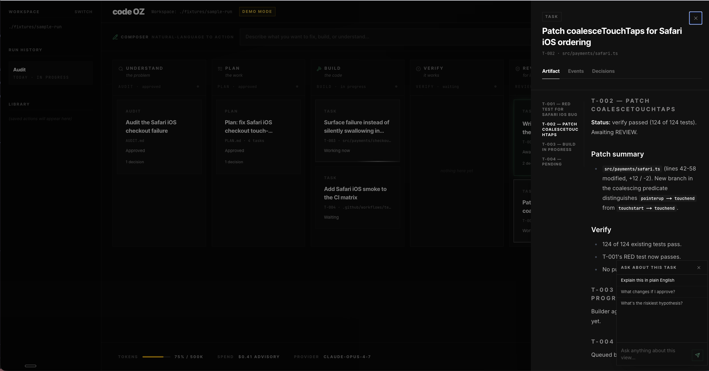
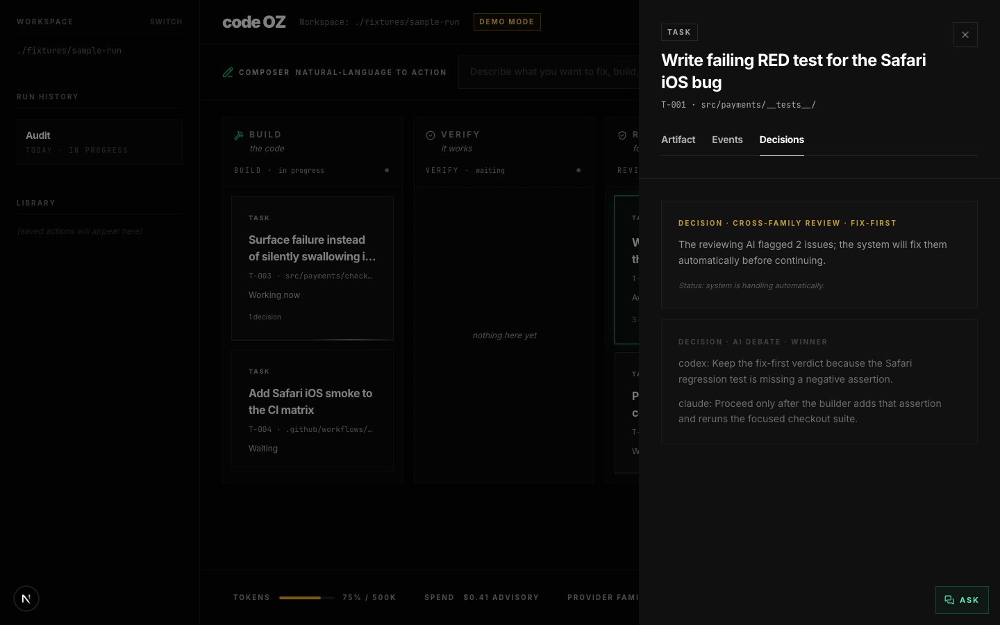
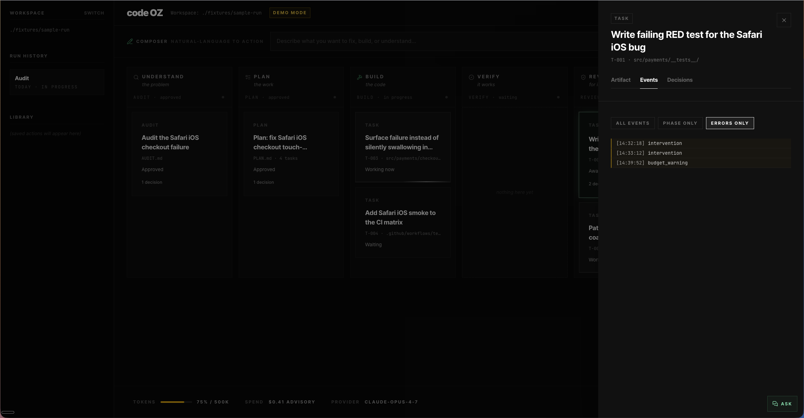
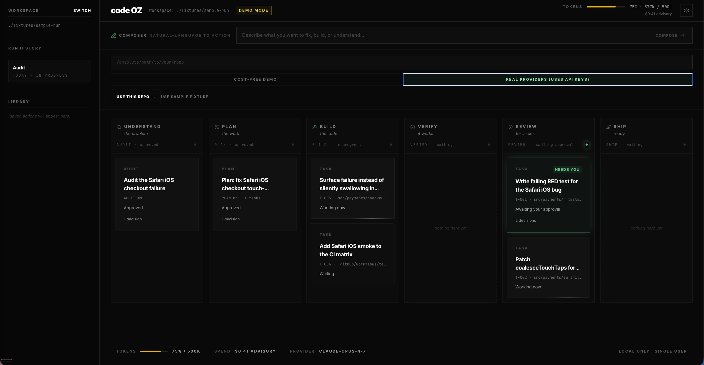

# code-oz-gui

> A Kanban board for AI-driven software runs. Drives the [`code-oz`](https://github.com/omerakben/code-oz) CLI through its phase-graph SDLC (`AUDIT → PLAN → BUILD → VERIFY → REVIEW → SHIP`) with a non-developer-friendly drawer for every artifact, event, and decision.

<p align="center">
  
</p>

## TL;DR

- **Kanban metaphor for the AI SDLC.** Six columns map to `code-oz`'s phases. Cards are runs (audit, plan) or tasks (build, verify, review). Click any card to see its artifact, events, and decisions.
- **Cross-family by design.** Four LLM providers each own one role — Claude personas, OpenAI cross-family review, xAI integration, Google Gemini Flash for the in-GUI helper. The single-family-bias problem is the entire product thesis.
- **Cost-safe by default.** Fresh clones boot in `COST-FREE DEMO` mode (`--provider fake`). The cost-implication of switching to real providers is shown explicitly — no curious click can burn LLM tokens accidentally.

## What this is

`code-oz-gui` is a Next.js 15 App Router GUI for the [`code-oz`](https://github.com/omerakben/code-oz) CLI. It exists because the CLI is dense and operator-focused — events streaming across a terminal works for engineers but excludes the non-developer audience that benefits most from agentic software runs: BAs, PMs, QA, security reviewers, the founder-mode generalist.

In v0.1, the GUI can render brownfield `AUDIT` state and fixture runs. The production CLI AUDIT runtime lands in M17/v0.21; until then, first-run live smoke should use the cost-free fake path or greenfield flow.

The GUI surfaces a Kanban board of the SDLC phases the CLI orchestrates. Each phase is a column; each card carries its current state, artifact path, and decision count. Clicking a card opens a 520px right-side drawer with three tabs — **Artifact** (the rendered Markdown of `AUDIT.md` / `PLAN.md` / `BUILD_REPORT.md` etc., with section nav, SHA-bound provenance chip, and file:line citation linkification), **Events** (the SSE-fed monospace event log with filter chips and amber accents on failed events), and **Decisions** (gate approvals, AI verdicts, debate outcomes, open questions, budget warnings — five row shapes sharing one container).

The drawer always carries a collapsible **Ask** pill backed by Google Gemini Flash. It reads the current artifact and events on the server side and answers BA-friendly questions ≤4 sentences with file:line citations. The model never auto-generates content into the artifact — it explains what's there.

## How it looks

<table>
  <tr>
    <td></td>
    <td></td>
  </tr>
  <tr>
    <td align="center"><sub>Board + Artifact tab + AI helper explaining the audit</sub></td>
    <td align="center"><sub>Decisions tab — cross-family review verdict on a task</sub></td>
  </tr>
  <tr>
    <td></td>
    <td></td>
  </tr>
  <tr>
    <td align="center"><sub>Events tab — Errors filter with amber border accents</sub></td>
    <td align="center"><sub>Workspace form — cost-safe demo default + opt-in to real providers</sub></td>
  </tr>
</table>

## Architecture

```
┌─────────── Browser ───────────┐         ┌────── Next 15 server ──────┐         ┌──── code-oz CLI ────┐
│                               │         │                            │         │                     │
│  Board · Drawer · AIHelper    │ ─SSE──► │  /api/run/[runId]/events   │ ◄fs.watch  events.jsonl       │
│                               │ ───────►│  /api/run/[runId]/state    │         │  current.json       │
│                               │         │  /api/run/[runId]/artifact │ ──fs───►│  AUDIT.md, PLAN.md  │
│                               │ ──POST─►│  /api/run/start            │ ─spawn─►│  code-oz run        │
│                               │ ──POST─►│  /api/run/[runId]/abort    │ ─SIGTERM│                     │
│                               │ ──POST─►│  /api/helper/ask           │ ─HTTPS──► Google Gemini Flash │
└───────────────────────────────┘         └────────────────────────────┘         └─────────────────────┘
                                              │
                                              │ in-memory registry
                                              ▼
                                          { runId → { runDir, repoPath, lifecycle, providerMode } }
```

The server-side bridge (`lib/code-oz-spawn.ts` + `lib/run-store.ts` + `lib/run-registry.ts`) is the seam. Reader routes (`state`, `events`, `artifact`) ask the registry "where is `runId` X?" The registry answers `fixtures/sample-run/` for the demo, `<repoPath>/.code-oz/state/runs/<id>/` for live runs. The GUI sees one uniform contract.

## Provider families

| Family | Role | Model | Where it shows up |
|---|---|---|---|
| **Anthropic** | CLI personas — Auditor, Planner, Builder, Verifier, Reviewer | `claude-opus-4-7` | The `code-oz` CLI's primary agentic roles |
| **OpenAI** | Cross-family REVIEW + debate opponent | `gpt-5.5` at `xhigh` | Wired in the CLI; appears in the GUI's Decisions tab as the AI-verdict row |
| **xAI** | PE-1 outbound HTTP integration | `grok` variants | Independent CLI provider surface |
| **Google** | In-GUI helper for non-developer explanations | `gemini-3-flash-preview` | The drawer's `Ask` pill — see the hero shot above |

This distribution is deliberate. When a Claude-authored audit needs to be explained to a non-developer, the explanation runs on a different family. That's the whole product thesis on a single page.

## Quick start

```bash
# 1. Clone and install (Bun 1.1+ required; Node 22+ for the spawned subprocess)
git clone https://github.com/omerakben/code-oz.git
cd code-oz/code-oz-gui
bun install

# 2. Optional: enable the in-GUI helper
cp .env.example .env
# Edit .env and add GEMINI_API_KEY for the drawer Ask helper.
# CLI provider setup lives in ../docs/PROVIDER_SETUP.md.

# 3. Run the GUI
bun dev
# → http://localhost:3000
```

The first surface you see is the **sample fixture** — a fully-rendered Kanban view of a finished `code-oz` run against a hypothetical Safari iOS checkout bug. Click any card. Read the audit. Ask the helper to explain it.

When you want to drive a real run, click `Switch` in the sidebar and paste an absolute path to your repo.

## Two modes

### Cost-free demo (default)

Click `COMPOSE →` after typing a request and the GUI spawns `code-oz run --provider fake --request "<your text>"` against your repo. `--provider fake` returns scripted responses so:

- Zero LLM API tokens consumed.
- Run completes in seconds, not minutes.
- The full event-stream → board-population → drawer-update pipe is exercised end-to-end.

This is the right mode for a first try, for screenshotting, for CI, for any iteration where you're tuning the GUI itself.

### Real providers

Toggle the segmented control from `COST-FREE DEMO` to `REAL PROVIDERS (CLI AUTH)` in the workspace form. Now `COMPOSE →` spawns `code-oz run --request "..."` with the providers configured by the CLI. This is the actual product mode — Claude and Codex use their CLI login sessions, xAI uses `XAI_API_KEY`, and the drawer helper uses `GEMINI_API_KEY`.

The single provider setup table lives at [`../docs/PROVIDER_SETUP.md`](../docs/PROVIDER_SETUP.md).

The TopBar shows a `DEMO MODE` amber pill when the active run was spawned in fake mode, so you always know which kind of run you're looking at.

## What's working in v0.1.0-alpha

- ✓ Full fixture-mode demo with all six phase columns populated
- ✓ ArtifactView with Markdown rendering, section nav, SHA-bound provenance, citation linkification
- ✓ Events tab with `All` / `Phase only` / `Errors only` filters, sticky chip bar, auto-scroll, `Jump to live` pill, amber/red accents on failed events
- ✓ Decisions tab with 5 row kinds (gate-approval, AI-verdict, debate-outcome, open-question, budget-warning) including approve/revise CTAs and inline answer textarea
- ✓ Google Gemini Flash AI helper grounded on the run's events + artifact, ≤4-sentence answers with file:line citations
- ✓ Live `code-oz` subprocess spawning with auto-init, lifecycle tracking, abort button, exit pills
- ✓ Cost-safe demo default, explicit opt-in to real providers

Known v0.1-alpha gaps (planned for v0.2):

- Single concurrent live run per session (multi-run dashboard deferred)
- The drawer's `Ask another` reset on the AI helper response is functional but the answer doesn't render Markdown (plain text only)
- A11y baseline only — full WCAG 2.2 AA audit not yet complete
- Live brownfield AUDIT runtime waits for CLI M17/v0.21; v0.1 renders the state and sample fixture honestly
- Mobile breakpoint not designed; desktop-only for v0

## Stack

| | |
|---|---|
| Framework | Next.js 15.5 (App Router, RSC default) |
| Runtime | Bun for dev server, Node 22 for spawned subprocess |
| Styling | Tailwind CSS v4, motion/react for transitions |
| Icons | lucide-react |
| Markdown | react-markdown + remark-gfm + @tailwindcss/typography |
| State | Local component state + custom `useRunStream` hook with SSE |

## Acknowledgments

`code-oz-gui` is one part of a larger thesis on cross-family agentic SDLC. The CLI it drives is at [omerakben/code-oz](https://github.com/omerakben/code-oz). The full design brief (`docs/CLAUDE_DESIGN_BRIEF.md`) explains every component, vocabulary swap, and CSS override.

Built with Claude Opus 4.7 (architecture + review) and OpenAI gpt-5.5-codex via [Codex CLI](https://github.com/openai/codex) (implementation). The cross-family discipline is both the product and the way the product was built.

## License

MIT — see `LICENSE`.
